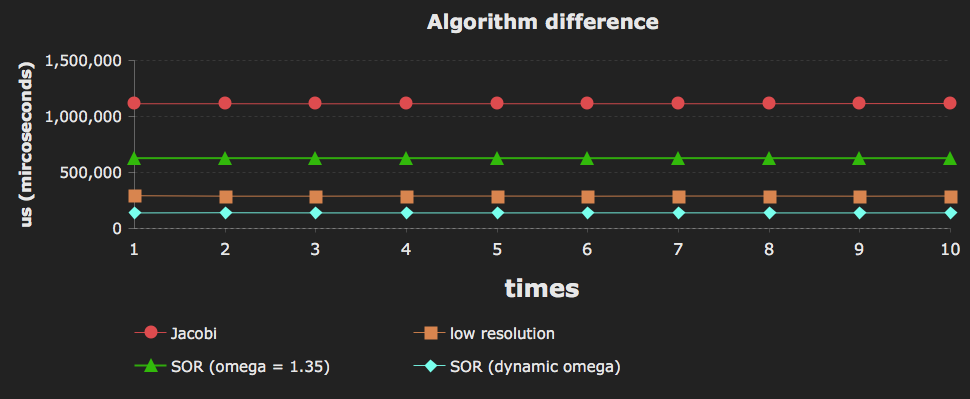

## Interesting results

-><-

-> <-

->Background, target and the mask<-

-><-

->Image blending<-

<div style="page-break-after: always;"></div>

## Optimize for acceleration

<div style="text-align: justify;">

### GPU info


```
+------------------------------------------------------+
| NVIDIA-SMI 361.42     Driver Version: 361.42         |
|-------------------------------+----------------------+
| GPU  Name        Persistence-M| Bus-Id        Disp.A |
| Fan  Temp  Perf  Pwr:Usage/Cap|         Memory-Usage |
|===============================+======================+
|   0  GeForce GTX 950     Off  | 0000:01:00.0      On |
| 33%   40C    P8     8W /  90W |    482MiB /  2044MiB |
+-------------------------------+----------------------+
```

### Executed time via basic method

These are the GPU run time 10 times using Jacobi method.

```
 1st time: 1113771us
 2nd time: 1113888us
 3rd time: 1113197us
 4th time: 1113896us
 5th time: 1113891us
 6th time: 1113780us
 7th time: 1113824us
 8th time: 1113931us
 9th time: 1115095us
10th time: 1115653us
```

Average time: *1.1140926 seconds*

<div style="page-break-after: always;"></div>

### Using lower resolution

* Code can be found in `lab3_accelerate_a.cu` file.

I used the method from TA in problem 1. I upsample the `{diffX, diffY}` = `{0, 1}`, `{1, 0}`, `{0, -1}` and `{-1, 0}`. There are the nearest point from center. Then, I replace the points like a triangle, there are `{0, 2}`, `{1, -1}` and `{-1, -1}`. Because centroid point of three points is center point **G(0, 0, 0)**, is the same with basic method (4 points).

Finally, I got a better result below. From 20,000 iterations to becomes **6,000 iterations** to converge, and the images are very similar via watching by eyes.

```
 1st time: 292607us
 2nd time: 288680us
 3rd time: 288771us
 4th time: 289976us
 5th time: 289635us
 6th time: 288571us
 7th time: 289866us
 8th time: 289869us
 9th time: 288590us
10th time: 290020us
```

Average time: *0.2896585 seconds*

<div style="page-break-after: always;"></div>

#### Upsampling

-><-

->Fig1. Using the new upsampling points like a triangle<-

#### Result images

-> <-

->Fig2. *Jocobi 2,000 iters* and *low resolution 1,000 iters*<-

-> <-

->Fig3. *Jocobi 6,000 iters* and *low resolution 2,000 iters*<-

-> <-

->Fig4. *Jocobi 20,000 iters* and *low resolution 6,000 iters*<-

<br>

### Using SOR method

* Code can be found in `lab3_accelerate_b.cu` file.

I found the best **w** is near *1.35* in this case. If **w** is over *1.35* too much, the converge will fail and get the wrong image blending. If I decreased **w** value until close *1*, the converge speed will be slower than before.

Finally, I got a better result below. From 20,000 iterations to becomes **10,000 iterations** to converge, and the images are very similar via watching by eyes.

```
 1st time: 628234us
 2nd time: 628267us
 3rd time: 628037us
 4th time: 628185us
 5th time: 628117us
 6th time: 627981us
 7th time: 628320us
 8th time: 628162us
 9th time: 627972us
10th time: 628328us
```

Average time: *0.6281603 seconds*

<div style="page-break-after: always;"></div>

#### Result images

-> <-

->Fig5. *Jocobi 2,000 iters* and *SOR 1,000 iters*<-

-> <-

->Fig6. *Jocobi 6,000 iters* and *SOR 2,500 iters*<-

-> <-

->Fig7. *Jocobi 20,000 iters* and *SOR 10,000 iters*<-

<div style="page-break-after: always;"></div>

### Summary

We can see the figure below, the method of low resolution is ***faster than*** SOR method. Why I said "faster" instead of "better"? Because decrease the resolution means losing the information of image. Maybe is difficult to aware from human, but there's much difference to computers. It just like the **dithering** (Computer Graphics), the target is that making people to satisfy when the compressing image.

-><-

->Fig8. Algorithm comparison<-